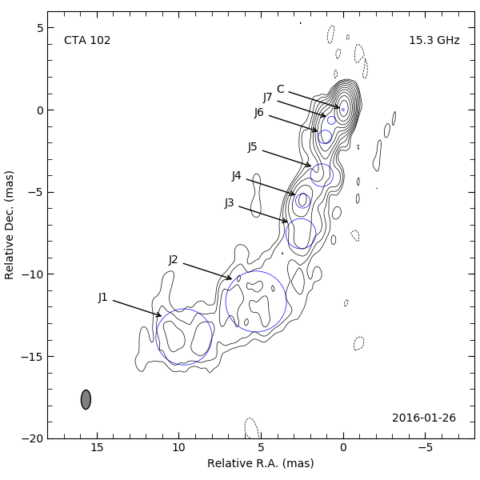
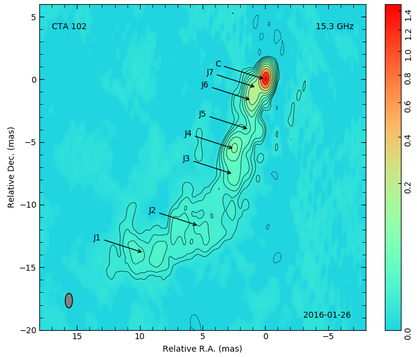
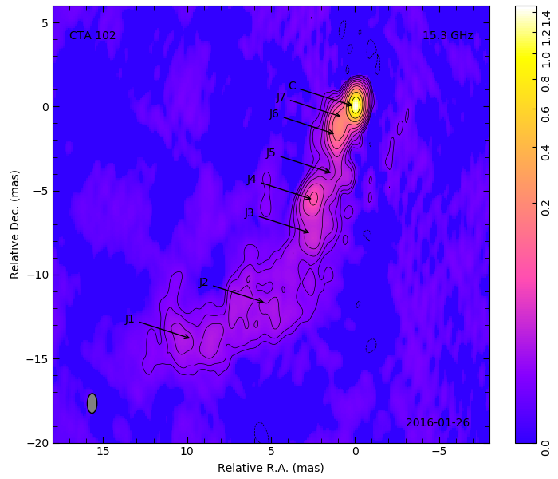
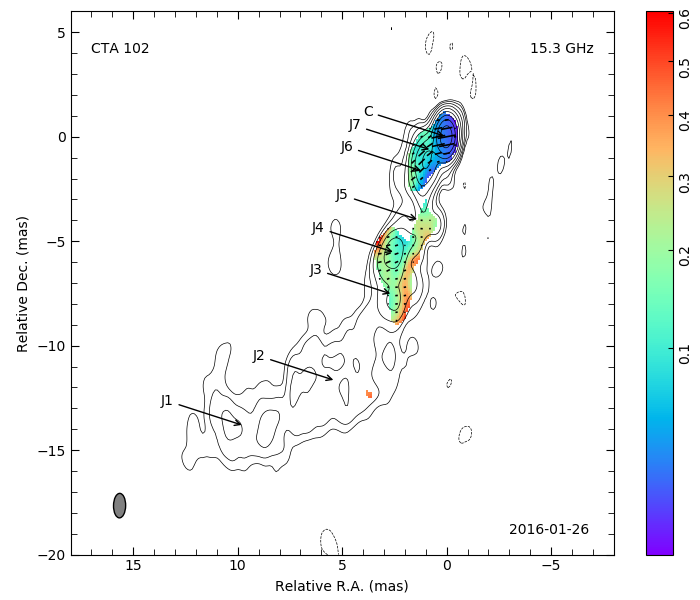
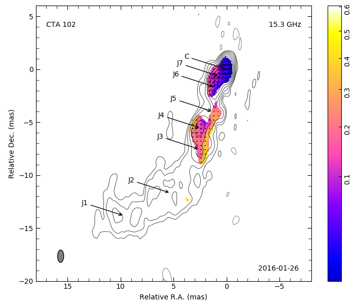

# vlpy
Some python programs for VLBI data analysis and visualization
1. contour.py plot contour map
2. mapplot.py plot color map
3. polplot.py plot polarization image
4. cc2annotation.py creatie annotation.txt file as an input of contour.py, mapplot.py or polplot.py
5. cc2tex.py convert AIPS CC table to latex table
6. cc2mod.py AIPS CC table to Difmap mod file
7. prtan.py Print AN table in uvfits file

## Installation
In order to run the Python programs, it is needed to make the xxx.py file can be excuted. You can do this with chmod command. Then you should put the xxx.py file in /usr/local/bin or add the root dirtory of the python code to PATH enviroment variable.
1. copy file
	chmod a+x contour.py
	cp coutour.py ~/myapp
2. set envioment parameters
	Add the following line to ~/.bashrc
	export PATH=$PATH:/home/username/myapp
	source ~/.bashrc

## contour.py
This program is used to plot contour map from fits image.
### Runnig program
	1. contour.py <input.fits>
	2. contour.py <input.fits> <output.pdf>
	3. contour.py <input.fits> <output.jpg> <cmul> <win>
### Examples
	contour.py cta102.fits
	contour.py -c 1.8e-3 -w '18 -8 -20 6' -a cta102-note.txt -i cta102.fits -o cta102.png
	contour.py -i input.fits -o output.png -c 0.001 -w "15 -15 -25 5"


## mapplot.py
plot color map from fits image

### Parameters
+ -i, --infile: 输入文件，该文件必须是fits图像。例如：cta102.fits
+ -o, --outfile: 输出文件，文件可以是pdf, png, jpg格式。例如: cta102.png, cta102.pdf
+ -f, --figsize: 输出图像的尺寸，单位是英寸。有时候colormap和绘图区没有对齐，可以通过调整figsize使其对齐。例如： '7 6', '6.8 6'。两个参数分表表示宽和高，中间用空格隔开，并且放在两个引号之间
+ -w, --win: 绘图区域。例如： '18 -8 -20 6'，'15 -15 -25 5'。四个参数分别表示左边界、右边界、下边界、上边界。参数之间用空格隔开，参数放在引号之间。
+ -b, --bpos: 波束位置。可选参数。有时候程序设置的波束位置不太合适，可以通过bpos参数进行修改。如'16 -18'，两个参数分别表示横纵坐标，中间用空格隔开。
+ -c, --cmul: 等值线的小值。根据图像的噪声设置，一般为三倍噪声。也可根据自己的目的，任意设置。如: 0.003, 1.8e-3, 1.6e-4 等格式，单位是Jansky。
+ -l, --levs: 等高线值列表。可选参数。默认值是cmul X (-1, 1, 2, 4, 8, 16, 32, 64, 128, 256, 512, 1024, 2048, 4096)
+ -a, --annotatefile: 标记文件，主要用于在图像上添加文字，箭头等。
+ -n, --normalize: 颜色归一化参数。有线性、对数、双对数、幂律等类型可供选择。[matplotlib.colors](https://matplotlib.org/3.2.1/api/colors_api.html)
+ -N, --ncut: 剪切颜色表，颜色表是一个长度为256，下标为0~255的数组。默认的颜色表会让图像背景非常暗，为了避免背景太暗，可以把颜色表中较暗的颜色去掉。方法是设置-N参数，-N 50 意思是剪切掉颜色表中最低的50个颜色。
+ --colormap: 颜色表，有jet, rainbow, plasma, hot, gnuplot, gnuplot2 等选项可供选择。[Choosing Colormaps in Matplotlib](https://matplotlib.org/3.1.1/tutorials/colors/colormaps.html)

### Examples:
	1. mapplot.py -i cta102.fits -o cta102-color.pdf -c 1.8e-3 -w '18 -8 -20 6' -f '7 6' -n 'power 0.5'
	2. mapplot.py -w '18 -8 -20 6' -f '4.0 6' -n 'power 0.5' cta102.fits 1.8e-3
	3. mapplot.py -i cta102.fits -o cta102-rainbow.png -w "18 -8 -20 6" -f "7 6" --cmul 1.8e-3  -a cta102-annotation.txt --colormap rainbow -n 'power 0.4' -N 80
	4. mapplot.py -i cta102.fits -o cta102-color.pdf -w "18 -8 -20 6" -f "7 6" --cmul 1.8e-3 --colormap gnuplot -n 'power 0.3' -N 50
	5. mapplot.py -i cta102.fits -o cta102-gnuplot2.png -w "18 -8 -20 6" -f "7 6" --cmul 1.8e-3 --colormap gnuplot2 -n 'power 0.3' -N 80 -a cta102-annotation.txt





### annotatefile
annotatefile是一个文本文件。每一行保存一条要在图像上标注的内容。可选类型有文字，箭头、箭头+文字、椭圆。

+ 文字: text, 17, 4, CTA 102。第一个参数表示标记类型是文字，第2、3个数字表示文字在图像上显示的位置。第4个参数表示要显示的文字内容。参数之间用逗号隔开，逗号两边的空格会被清楚。
+ 椭圆： ellipse, 0, 0, 1, 2, 30。 第一个参数表示标记类型为椭圆，第2、3个数字表示椭圆中心的坐标。第4、5、6个参数分别表示椭圆的长轴、短轴、方位角。
+ 箭头：arrow, 0, 0, 4, 1。第一个参数表示标记类型为箭头。第2、3个参数表示箭头位置坐标。第4、5个参数表示箭头尾部坐标。
+ 箭头+文字： annotation, 0, 0, 1, 3, Core。第1个参数表示标注类型。第2、3个参数表示箭头坐标，第4、5个参数表示箭头尾部坐标。第6个参数表示文字内容。
如果想把用椭圆表示模型、并添加文字注释，可以用cc2annotation.py生成annotatefile文件。然后再修改这个文件，将其作为mapplot.py的输入文件。

### normalize参数
归一化有4中方式、线性、幂律、对数、双对数。虽然程序会自动设置vmin和vmax，但是还是建议用户设置合理的vmin和vmax值，否则会出现无法预料的情况。
+ 线性： linear vmin, vmax。线性归一化。
+ 幂律： power gamma vmin vmax。幂律函数归一化，一般gamma取0～1之间的值。如果gamma小于1时vmin小于0，则会出现一部分无效的值。因为负数无法开平方。所以，当gamma小于0且数据包含负数时，程序会自动将vmin设置为0。
+ 对数： log vmin vmax。对数归一化。
+ 双对数： symlog linthresh linscale vmin vmax。双对数归一化。因为在实数范围内只有整数可以取对数，因此数据小于等于零时计算会出错。为了避免出错，设置一个阈值，当数据绝对值小于阈值时，采取线性归一化方案。
+ 双斜率： twoslope vcenter vmin vmax。双斜率归一化。
注意，以上参数要放在引号之间，否则会解析错误。因为命令行下，系统默认参数之间用空格隔开。如果参数值本身含有空格就会解析错误。为了避免解析错误，参数应放在单引号或双引号之间。

### See also:
1. Colormap: [Choosing Colormaps in Matplotlib](https://matplotlib.org/3.1.1/tutorials/colors/colormaps.html)
2. normalize : [matplotlib.colors](https://matplotlib.org/3.2.1/api/colors_api.html)

## polplot.py
This program is use to plot polarization map from vlbi fits image.
You should specify the input fits images by -i or --infile,
	output file by -o or --output,
	contour levs by -l or --levs
	contour base by -c or --cmul
	polarization parameters by -p or --pol: "icut pcut inc scale"
	plot window by -w or --win
	restore beam position by -b or --bpos
	figsize by -f or --figsize

### Parameters
+ -i, --infile: 输入文件，该文件必须是fits图像。例如：-i 'i.fits q.fits u.fits'
+ -o, --outfile: 输出文件，文件可以是pdf, png, jpg格式。例如: cta102.png, cta102.pdf, pol-color.jpg
+ -p, --pol：偏振参数。四个浮点数分别表示icut, pcut, inc, scale。例如：-p '3.2e-3 2.43e-3 4 1'。总流量低于icut或偏振流量$p=\sqrt(q^2+u^2)$低于pcut的像素点将会被切掉。inc表示每隔多少个像素显示一个偏振线。scale表示偏振长度，值越小，线越长。
+ -f, --figsize: 输出图像的尺寸，单位是英寸。有时候colormap和绘图区没有对齐，可以通过调整figsize使其对齐。例如： -f '7 6', --figsize '6.8 6'。两个参数分表表示宽和高，中间用空格隔开，并且放在两个引号之间
+ -w, --win: 绘图区域。例如： -w '18 -8 -20 6'，--win '15 -15 -25 5'。四个参数分别表示左边界、右边界、下边界、上边界。参数之间用空格隔开，参数放在引号之间。
+ -b, --bpos: 波束位置。可选参数。有时候程序设置的波束位置不太合适，可以通过bpos参数进行修改。如'16 -18'，两个参数分别表示横纵坐标，中间用空格隔开。
+ -c, --cmul: 等值线的小值。根据图像的噪声设置，一般为三倍噪声。也可根据自己的目的，任意设置。如: 0.003, 1.8e-3, 1.6e-4 等格式，单位是Jansky。
+ -l, --levs: 等高线值列表。可选参数。默认值是cmul X (-1, 1, 2, 4, 8, 16, 32, 64, 128, 256, 512, 1024, 2048, 4096)
+ -a, --annotatefile: 标记文件，主要用于在图像上添加文字，箭头等。-a annotation.txt
+ -n, --normalize: 颜色归一化参数。有线性、对数、双对数、幂律等类型可供选择。例如 -n 'power 0.5'，-n 'linear'。[matplotlib.colors](https://matplotlib.org/3.2.1/api/colors_api.html)
+ -N, --ncut: 剪切颜色表，颜色表是一个长度为256，下标为0~255的数组。默认的颜色表会让图像背景非常暗，为了避免背景太暗，可以把颜色表中较暗的颜色去掉。方法是设置-N参数，-N 50 意思是剪切掉颜色表中最低的50个颜色。
+ --colormap: 颜色表，有jet, rainbow, plasma, hot, gnuplot, gnuplot2 等选项可供选择。[Choosing Colormaps in Matplotlib](https://matplotlib.org/3.1.1/tutorials/colors/colormaps.html)


### Examples:
	1. polplot.py -i 'i.fits q.fits u.fits' -o cta102-pol-gnuplot2.png -w '18 -8 -20 6' -a annotation.txt -c 1.8e-3 -f '7 6' --colormap gnuplot2 -p '3.2e-3 2.43e-3 4 1' -N 50 -n 'power'
	2. polplot.py -i 'i.fits q.fits u.fits' -o cta102-pol-rainbow.png -w '18 -8 -20 6' -a annotation.txt -c 1.8e-3 -f '7 6' --colormap rainbow -p '3.2e-3 2.43e-3 4 1' -N 0 -n 'power 0.5'





## cc2annotation.py
This program is used to create cta102-note.txt file which is input file of contour.py. The cta102-note.txt file contain some annotations parameters.
1. text, x, y, some text
2. ellipse, x, y, major axis, minor axis, posiation angle
3. annotation, x1, y1, x2, y2, some text

	cc2annotation.py 2230+114m.fits cta102-annotation.txt

## cc2tex.py

	cc2tex.py 2230+114m.fits out.tex
```latex
\begin{table}
\begin{tabular}{ccccccc}
comp & flux & x & y & r & pa & d \\
 & $\mathrm{mJy}$ & $\mathrm{mas}$ & $\mathrm{mas}$ & $\mathrm{mas}$ & $\mathrm{{}^{\circ}}$ & $\mathrm{mas}$ \\
C & 1535.744 & 0.000 & 0.000 & 0.000 & 0.0 & 0.137 \\
J7 & 272.613 & 0.704 & -0.649 & 0.957 & 132.6 & 0.483 \\
J6 & 292.153 & 1.095 & -1.665 & 1.993 & 156.2 & 0.829 \\
J5 & 76.768 & 1.291 & -3.991 & 4.195 & 155.6 & 1.386 \\
J4 & 143.056 & 2.449 & -5.552 & 6.068 & 146.7 & 0.879 \\
J3 & 121.199 & 2.569 & -7.550 & 7.975 & 161.2 & 1.837 \\
J2 & 167.977 & 5.296 & -11.681 & 12.825 & 162.1 & 3.704 \\
J1 & 138.498 & 9.685 & -13.834 & 16.887 & 145.0 & 3.418 \\
\end{tabular}
\end{table}
```

## cc2mod.py
cc2mod.py 2230+114m.fits out.mod
1.535744309425354 0.0483061708509922 -28.359661102294922 0.13652236759662628 1.0 105.94539642333984 1.0
0.2726133465766907 0.9117016196250916 131.66152954101562 0.482522577047348 1.0 -96.34020233154297 1.0
0.14305609464645386 6.019773483276367 156.23577880859375 0.8786846995353699 1.0 -122.73522186279297 1.0
0.1679767519235611 12.776947021484375 155.62477111816406 3.7039573192596436 1.0 96.7098388671875 1.0
0.29215338826179504 1.9444652795791626 146.54136657714844 0.8294569253921509 1.0 -145.30482482910156 1.0
0.1211988627910614 7.927224636077881 161.2664031982422 1.8366743326187134 1.0 -145.30482482910156 1.0
0.07676761597394943 4.147329807281494 162.20083618164062 1.3862905502319336 1.0 -160.34616088867188 1.0
0.13849778473377228 16.839195251464844 144.98582458496094 3.4181699752807617 1.0 -130.42608642578125 1.0

## Aacknowledgment
If you use any of these programs in a publication, It is recommanded to cite ([Li et al., 2018, ApJ, 854, 17](https://ui.adsabs.harvard.edu/abs/2018ApJ...854...17L/abstract)) and include the following acknowledgment: "This research has made use of vlpy which is a Python package use for VLBI data analysis."

